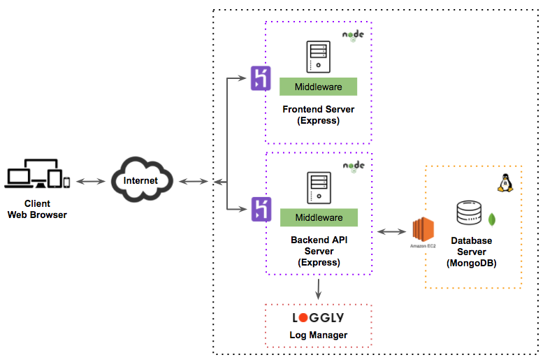

# CS3219 Assignment 4/5 Visualization (Group 5)

Due to the way the human brain processes information, using charts or graphs to visualize large amounts of complex information allows human to understand and retain information better. Data visualization is a quick way to communicate information in a visual way and highlight trends/patterns in the information. In this assignment, first 200,000 lines from the full dataset at [http://labs.semanticscholar.org/corpus/](http://labs.semanticscholar.org/corpus/) are used to create visualization using d3.js.

The overall aim of CIR is to provide Simon with a usable interface which accepts his intuitive queries and provides him with outputs/visualizations to help him analyze various aspects of research publications. In particular, Simon is interested in trend-based queries.

## SiteMap
* [Developer Guide](#developer-guide)
* [About Us](#about-us)

### Developer Guide

* [Setting Up](#setting-up)
* [Code Style](#code-style)
* [Design](#design)
* [Developer Tools](#developer-tools)

#### Setting up
##### Prerequisites

1. [**Node.js**](https://nodejs.org/en/download/)
2. A **code editor**. (We recommend [Visual Studio Code](https://code.visualstudio.com/))
3. [**MongoDB**](https://www.mongodb.com/download-center#community)

##### Install dependencies
To install dependencies enter project folder and run following command:
``` 
npm install
```

##### Run frontend server
To run frontend server, execute:
```
npm run start-frontend
```

##### Run backend API server
To run backend API server, execute:
```
npm run start-api-server
```

##### Test
A quick test to check if the backend API server is to run:
`curl localhost:3000` or equivalent

#### Code style
We are following closely to [Airbnb](https://github.com/airbnb/javascript) Javascript style but with a bit modification.

&ast; For Visual Studio Code, you can download an [ESLint extension](https://marketplace.visualstudio.com/items?itemName=dbaeumer.vscode-eslint) from the marketplace.

#### Design
Below is the architecture diagram of the whole solution for this project.

<br>

#### Developer Tools

* [insomnia](https://insomnia.rest/download/) - Rest client to inspect api calls

### About Us
We are a team based in the [School of Computing, National University of Singapore](http://www.comp.nus.edu.sg/).

#### Project Team
* [Chan Lup Seng]()https://github.com/lupseng
* [Chia Wei Kang](https://github.com/weikangchia)
* [Joel Lim](https://github.com/aljorhythm)
* [Tang Di Feng](https://github.com/e0011840)
