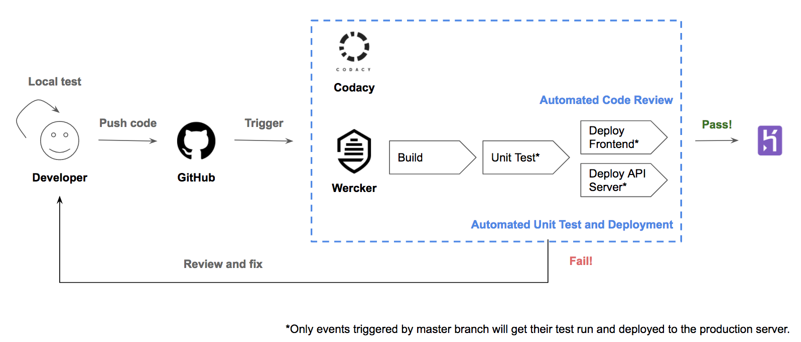

# Developer Guide

* [Setting Up](#setting-up)
* [Code Style](#code-style)
* [Design](#design)
* [API Endpoints](#api-endpoints)
* [Testing](#testing)
* [Developer Tools](#developer-tools)
* [Others](#others)

## Setting up
### Prerequisites

1. [**Node.js**](https://nodejs.org/en/download/)
2. A **code editor**. (We recommend [Visual Studio Code](https://code.visualstudio.com/))
3. [**MongoDB**](https://www.mongodb.com/download-center#community)

### Install dependencies
To install dependencies enter each project folder (`/backend-api` and `/frontend`) and run following command:
``` 
npm install
```

### Env files
1. Go to `/backend-api` and create a new file `.env` from `.env.example`.
2. You should only change the port number and mongodb uri to suit your environment. By default the API server is running on port 3000.
3. Go to `/frontend` and create a new file `.env` from `.env.example`.
4. You should only change the port number to suit your environment. By default the frontend server is running on port 9000.

### Setup database server
Follow the instructions in this [online documentation](https://docs.mongodb.com/manual/administration/install-community/) to install the MongoDB server.

1. Start the MongoDB server.
   ```
   sudo mongod
   ```
2. Open the MongoDB console and create the database and collection:
   <br/>
   ```
   // create database
   use CS3219

   // create papers collection
   db.createCollection("papers", {collation: {locale: 'en', strength: 2}})
   ```
4. Import the datasets into the database.
   <br/>
   ```
   ./mongoimport --db CS3219 --collection papers --file <paper json file location>
   ```
5. Create indexes:
   <br/>
   ```
   // create indexes to improve query time
   db.papers.createIndex({venue: 1})
   db.papers.createIndex({"authors.name": 1})
   db.papers.createIndex({year: 1})
   db.papers.createIndex({keyPhrases: 1})
   db.papers.createIndex({id: 1})
   ```
### Run frontend server
To run frontend server, go to `/frontend` folder and execute:
```
npm start
```

### Run backend API server
To run backend API server, go to `/backend-api` folder and execute:
```
npm start
```

### Test
A quick test to check if the backend API server is to run:
`curl localhost:3000` or equivalent

## Code style
We are following closely to [Airbnb](https://github.com/airbnb/javascript) Javascript style but with a bit modification.

&ast; For Visual Studio Code, you can download an [ESLint extension](https://marketplace.visualstudio.com/items?itemName=dbaeumer.vscode-eslint) from the marketplace.

## Design
Below is the architecture diagram of the whole solution for this project.

<br>

### Frontend

* [Developer Guide](/frontend/README.md)

### CI/CD Process

<br>

## API Endpoints
### Top
- **[<code>GET</code> top-X-of-Y](endpoints/top-X-of-Y/GET_top-X-of-Y.md)**

### Trends
- **[<code>GET</code> trends/conference](endpoints/trends/GET_conference.md)**
- **[<code>GET</code> trends/keyphrase](endpoints/trends/GET_keyphrase.md)**

### Auto-complete
- **[<code>GET</code> autocomplete](endpoints/GET_autocomplete.md)**

### Graphs
- **[<code>GET</code> graphs/incitation](endpoints/graphs/GET_incitation.md)**

## Testing

### Before
Before every test, execute the following command to ensure all dependency are installed.
```
npm install
```

### Run
To run the test for the backend API codes, go to `backend-api` directory and execute: 
```
npm test
```

At the end of the test, you will see the test result in your terminal. A sample of the test result is shown below.

<br>

## Developer Tools

* [insomnia](https://insomnia.rest/download/) - Rest client to inspect api calls

## Others

- d3plus (v1) [documentation](https://github.com/alexandersimoes/d3plus/wiki/Visualizations)
- [Pages](pagesWithUsefulResults.md) with useful results
